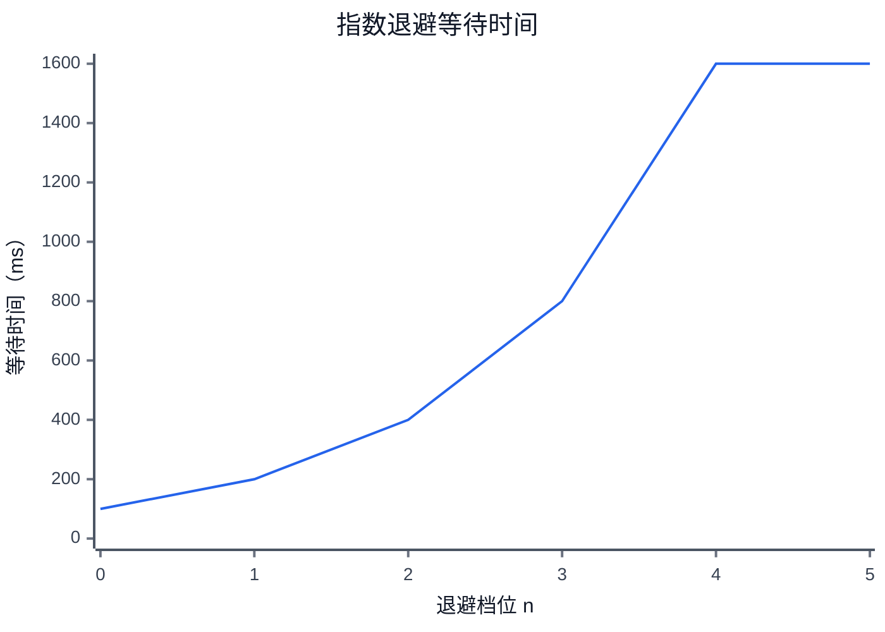

# Blue Espeon Note Style

## Role

This skill defines vault conventions for the Blue Espeon Obsidian vault.

It answers:

- where a note should live;
- how a note should be named;
- whether a note should be a companion note or a reusable topic note;
- what template shape the note should follow;
- how backlinks and wikilinks should be placed;
- whether a visual is useful;
- which supported visualization syntax and subtype should be used;
- whether the note has one center thesis or should be split.

It does not perform full note rewrites by itself.

## Use When

Use this skill when the task involves:

- creating or placing a note in the Blue Espeon vault;
- deciding note directory or naming;
- adding companion-note backlinks;
- checking whether a note violates the single-thesis rule;
- choosing among Mermaid, Charts, Dataview, Markmap, Infographic, or an existing Excalidraw asset;
- applying vault-level style expectations to another Obsidian editing skill.

## Do Not Use As Primary Skill When

- The task only changes YAML metadata: use `obsidian-frontmatter-metadata`.
- The task rewrites an old non-technical note: use the matching general document optimization skill.
- The task rewrites an old technical note, experiment note, code note, or test note: use the matching technical document optimization skill.
- The task reconstructs repository evidence: use `source-walk` or `note-code-walkthrough` according to the router.

When paired with another skill, this skill supplies conventions only. The concrete editing skill owns the workflow and final note.

# Core Vault Rules

## Default Note Template

Every new Markdown content note may reuse `Templates/default-note.md`, unless the target directory clearly uses another established pattern.

The YAML frontmatter must contain exactly these four fields:

```yaml
---
source: ""
tags: []
summary: ""
read_status: unread
---
```

Keep:

- `source`;
- `tags`;
- `summary`;
- `read_status`;
- `## AI摘要`;
- `## 正文`.

Do not add convenience metadata such as `title`, `aliases`, `created`, `updated`, `related`, `repo`, `branch`, `source_commit`, `source_files`, `test_status`, `read_depth`, `read_at`, `read_note`, or visualization-plugin settings.

Generated note content goes under `## 正文`.

Fill `## AI摘要` only when a concise summary is available.

This template rule does not apply to skills, plugin files, templates, or other control/configuration documents.

## Companion Notes

Use a same-directory companion note only when the new note is source-specific or project-specific.

For a companion note:

1. Place it beside the source note.
2. Preserve the local naming scheme.
3. Add a top-line backlink such as:

```markdown
关联笔记：[[Source Note#Section]]
```

4. Add a short forward wikilink in the source note near the relevant section.

## Reusable Topic Notes

For durable reusable knowledge, choose the best existing topic directory instead of blindly placing the note beside the source note.

A reusable note should have one center thesis.

Good:

- `FastAPI CPU密集型任务执行器设计`
- `FastAPI同步阻塞代码发现机制`
- `FastAPI与上层网关超时配置同步`

Bad:

- `FastAPI网关并发与CPU任务方案` when it mixes unrelated mechanisms and experiments as peer topics.
- `网关数据模型与分层设计` when it mixes application layers, Redis async, serializer APIs, response envelopes, and domain tables.

If the thesis sentence needs "and" to join unrelated topics, split the note.

## Directory Placement

Choose by durable subject, not by where the question originated.

- Project-specific design, requirements, incidents, or implementation decisions: `Archive/500-Project/<project>/...`.
- Reusable programming language, framework, library, code pattern, tests, or runtime behavior: `Archive/200-Program/210-Code/<language>/...`.
  - FastAPI, Starlette, ASGI, middleware, response handling, concurrency, or app architecture: `Archive/200-Program/210-Code/Python/fastapi`.
  - Python asyncio/event loop/concurrency not tied to FastAPI: `Archive/200-Program/210-Code/Python/asyncio`.
  - SQLAlchemy: `Archive/200-Program/210-Code/Python/sqlalchemy`.
  - pytest/testing technique: `Archive/200-Program/210-Code/Python/pytest`.
  - Python standard library behavior: `Archive/200-Program/210-Code/Python/stdlib`.
- Infrastructure products and operations: `Archive/300-Infras/<technology>`.
- Computer-science concepts independent of one implementation stack: `Archive/100-Computer Science/...`.
- Software/tool usage not primarily code-library knowledge: `Archive/600-Software/...`.
- Playbooks, learning maps, debugging guides, and cross-topic guidance: `Guide/...`.

Do not create a new directory just to avoid a decision. If no existing directory is clearly suitable, ask the user or report uncertainty.

# Wikilink Rules

Use wikilinks for:

- real prerequisites;
- source notes;
- durable related notes;
- companion-note navigation.

Do not wikilink every noun.

Do not add decorative links.

Do not use Obsidian table cells with `[[#heading|alias]]`; the `|` can break Markdown table parsing. Use `[[#heading]]: explanation` instead.

# Visualization Operating Model

## Supported Set

| Capability | Status | Rendering dependency |
|---|---|---|
| Mermaid, all 24 Obsidian-supported Mermaid 11.13 diagram families | stable target | Obsidian built-in Mermaid support |
| `chart` code blocks | stable | Charts community plugin |
| `dataview` / `dataviewjs` | stable when data is vault-derived | Dataview community plugin |
| DataviewJS-rendered charts | stable with constraints | Dataview + Charts |
| `markmap` code blocks | stable for outline views | Mindmap NextGen |
| `infographic` code blocks | experimental | BRAT + `hcg1023/obsidian-infographic` |
| Excalidraw embeds | existing assets only | Excalidraw community plugin |
| Plotly, ECharts, Tracker, custom HTML/JS | disabled by default | do not generate without a later explicit rule |

Do not invent another visualization syntax because it looks plausible.

## Visual Selection Order

Choose the lightest representation that answers the reader's question:

1. prose or a Markdown list for a simple definition or flat set;
2. Markdown table when exact values or side-by-side comparison matter;
3. the most semantically specific Mermaid family for relationships, mechanisms, structure, time, state, allocation, overlap, causality, or planning;
4. Charts for static numeric comparison, trend, distribution, or composition when Mermaid's numeric diagrams are not a better fit;
5. Dataview + Charts only when the source data should update from vault metadata;
6. Markmap when a Markdown-derived hierarchy should remain independent from Mermaid;
7. Infographic for a compact explanatory sequence or conclusion-first narrative;
8. an existing Excalidraw asset for a manually curated explanatory drawing.

A visual is optional, but high-density explanatory sections should actively evaluate whether one specialized visual can reduce reading cost.

## Visual Opportunity Triggers

Evaluate a visual when a section contains any of the following:

- three or more ordered stages;
- four or more named components with relationships;
- several participants exchanging messages;
- explicit states, transitions, ownership, or lifecycle rules;
- a hierarchy with at least two levels;
- a timeline, schedule, branch history, or progression;
- overlap, allocation, dependency, root-cause, or multidimensional comparison;
- a paragraph cluster whose meaning depends more on relationships than prose order.

Do not force a visual when the information is still simpler as a list or table.

## General Visual Rules

Every generated visual must satisfy all of these rules:

1. It answers one explicit reading question.
2. It appears next to the paragraph it supports.
3. Add one sentence before it explaining what to inspect.
4. Add one sentence after it stating the takeaway.
5. Keep the underlying claim understandable without rendering.
6. Do not repeat the whole surrounding section inside the visual.
7. Prefer zero to four visuals in a normal long note.
8. More than four visuals require an evidence-heavy note, long code walkthrough, architecture note, or clear multi-stage explanation.
9. Never use a visual to hide missing data, unclear units, or unsupported conclusions.
10. Never fetch remote data or execute network requests from a generated visualization block.
11. Do not use the same diagram family repeatedly merely because it is familiar.
12. When two adjacent sections answer different reading questions, prefer different suitable diagram families.
13. Treat contrast and legibility as correctness requirements, not optional decoration.
14. A chart that becomes unreadable under the user's Obsidian theme has failed the renderability contract even if its syntax parses.

For `note-conclusion-evidence`, preserve exact values in a compact Markdown table or raw evidence section. Treat the visual as a derived reading aid, not the only copy of the evidence.

## Renderability Contract

Before emitting a plugin-backed visual, verify:

- the fenced-code language is exactly supported;
- the Mermaid first-line declaration matches an allowed family;
- indentation and punctuation are internally consistent;
- labels, values, axes, dates, and series align where applicable;
- foreground and background colors have obvious visual contrast;
- no unverified field, option, template, icon, or API is invented;
- any vault path, tag, property, note name, or Excalidraw asset actually exists or is explicitly provided;
- a plain-text conclusion remains when rendering fails.

The target renderer for Mermaid is Obsidian's built-in Mermaid 11.13 support. Do not downgrade a semantically correct diagram to Flowchart solely because another chat client may not preview the subtype.

# Mermaid Rules

## Core Policy

All 24 Mermaid diagram families available in Obsidian's Mermaid 11.13 baseline are allowed.

Mermaid is not synonymous with Flowchart. Select the family from the reader's question before writing syntax.

Use the fenced-code language `mermaid` for every Mermaid family:

````markdown
```mermaid
<diagram declaration>
<diagram body>
```
````

Prefer stable, minimal syntax over decorative directives. Do not use remote icons, custom scripts, click callbacks, or configuration that weakens portability.

## Mandatory Type Selection Matrix

| # | Mermaid family | Preferred declaration | Use when the reader asks | Prefer over Flowchart when |
|---:|---|---|---|---|
| 1 | Flowchart | `flowchart TD` / `flowchart LR` | What path, branch, pipeline, or decision leads where? | No more specific family models the semantics |
| 2 | Sequence Diagram | `sequenceDiagram` | Who sends what to whom, and in what order? | Participants exchange calls, events, acknowledgements, retries, or responses |
| 3 | Class Diagram | `classDiagram` | What are the types, members, inheritance, and dependencies? | The subject is static code structure rather than runtime movement |
| 4 | State Diagram | `stateDiagram-v2` | What states exist and what triggers transitions? | Nodes represent states, lifecycle phases, or legal transitions |
| 5 | Entity Relationship Diagram | `erDiagram` | What entities, fields, cardinalities, and relationships exist? | The subject is a database or durable data model |
| 6 | User Journey | `journey` | What does a user experience across stages? | The explanation includes user actions, stages, and satisfaction or friction |
| 7 | Gantt | `gantt` | What is scheduled, dependent, overlapping, or delayed? | Time duration and task dependency are central |
| 8 | Pie | `pie` | How is one whole divided among a few categories? | The values form one meaningful total with no more than six slices |
| 9 | Quadrant Chart | `quadrantChart` | Where do items fall across two dimensions? | The argument is a 2×2 prioritization, positioning, or trade-off matrix |
| 10 | Requirement Diagram | `requirementDiagram` | Which requirements are satisfied, verified, derived, copied, or contained? | Traceability between requirements and implementation matters |
| 11 | Git Graph | `gitGraph` | How did branches, commits, merges, and releases evolve? | The subject is repository history or branch strategy |
| 12 | C4 Diagram | `C4Context` / `C4Container` / `C4Component` / `C4Dynamic` / `C4Deployment` | What system boundary or architecture level is being explained? | The subject is software architecture at a named C4 level |
| 13 | Mindmap | `mindmap` | What is the conceptual hierarchy around one root? | The content is hierarchical rather than sequential |
| 14 | Timeline | `timeline` | What happened across dates, eras, versions, or milestones? | Ordered events matter but task durations do not |
| 15 | Sankey | `sankey-beta` | How does quantity flow, split, or combine? | Edge magnitude represents traffic, money, messages, energy, or allocation |
| 16 | XY Chart | `xychart-beta` | How do numeric values change or compare on axes? | A compact line/bar plot is enough and the data is static in the note |
| 17 | Block Diagram | `block-beta` | How are functional blocks arranged and connected? | Spatial grouping and modular composition matter more than process order |
| 18 | Packet Diagram | `packet-beta` | How are bits or fields laid out in a protocol packet? | The subject is a binary/network header layout |
| 19 | Kanban | `kanban` | What work sits in each status column? | The subject is work-in-progress state rather than lifecycle semantics |
| 20 | Architecture Diagram | `architecture-beta` | How do services, groups, junctions, and directional connections compose? | A compact infrastructure/service topology is clearer than generic boxes |
| 21 | Radar Chart | `radar-beta` | How do several entities compare across shared dimensions? | Multidimensional profiles matter more than exact tabular lookup |
| 22 | Treemap | `treemap` | How is a hierarchy divided by relative size? | Nested part-to-whole allocation is central |
| 23 | Venn Diagram | `venn-beta` | What overlaps and what remains unique? | Set membership and intersection are the actual argument |
| 24 | Ishikawa Diagram | `ishikawa` | What categories of causes contribute to one effect? | Root-cause analysis has grouped causal branches |

## Flowchart Escape Rules

Before generating `flowchart` or `graph`, test these substitutions in order:

1. Calls or messages over time → `sequenceDiagram`.
2. States and transitions → `stateDiagram-v2`.
3. Database entities and cardinality → `erDiagram`.
4. Types, inheritance, interfaces, ownership, or static dependencies → `classDiagram`.
5. Dated events or version evolution → `timeline`.
6. Tasks with duration and dependencies → `gantt`.
7. Git branches and merges → `gitGraph`.
8. System boundaries and architecture levels → C4 or `architecture-beta`.
9. Functional modules with spatial composition → `block-beta`.
10. Hierarchical concepts → `mindmap`.
11. Two-axis positioning → `quadrantChart`.
12. Quantitative flows → `sankey-beta`.
13. Multidimensional comparison → `radar-beta`.
14. Overlap → `venn-beta`.
15. Root causes → `ishikawa`.
16. Protocol field layout → `packet-beta`.
17. Work-status columns → `kanban`.
18. Nested allocation → `treemap`.
19. Static numeric axes → `xychart-beta`.
20. Requirement traceability → `requirementDiagram`.
21. User stages and sentiment → `journey`.

Use Flowchart only after no specialized family represents the central semantics better.

## Mermaid Diversity Rules

- A note may contain several Mermaid families when they answer different questions.
- Do not use more than two Flowcharts in one normal note unless the note genuinely contains separate operational paths.
- If a note contains three or more Mermaid diagrams, actively seek at least two diagram families when semantically justified.
- Do not replace one good specialized diagram with several weak Flowcharts.
- Do not choose an exotic family solely to satisfy diversity.
- Prefer one diagram with a clear thesis over a visually impressive but overloaded diagram.
- Keep most diagrams within roughly 5-12 primary items; split dense diagrams by reading question.
- Keep labels short. Put caveats, evidence, and long explanations in prose.
- Avoid duplicating the same facts in Flowchart, table, and another Mermaid diagram unless each view serves a distinct task.

## Orientation And Density

For Flowchart:

- `TD` / `TB`: top-down lifecycle, decision, layered processing, or diagnosis;
- `LR`: pipelines, transformations, request paths, and short causal chains;
- `RL`: only when reverse flow is itself meaningful;
- `BT`: rarely, for dependency buildup or bottom-up composition.

For any Mermaid diagram:

- split diagrams that require excessive scrolling or tiny text;
- prefer meaningful grouping over crossing edges;
- avoid paragraphs inside nodes;
- do not encode every implementation detail;
- put the visual near the section where it lowers cognitive load.

## Experimental-Family Safeguards

The following are supported by the Obsidian baseline but use newer or beta declarations and require conservative syntax:

- `sankey-beta`;
- `xychart-beta`;
- `block-beta`;
- `packet-beta`;
- `architecture-beta`;
- `radar-beta`;
- `venn-beta`;
- `ishikawa`;
- `treemap`;
- C4 diagrams.

For these families:

1. Generate only syntax known for the selected family.
2. Avoid undocumented styling and layout directives.
3. Include adjacent prose or a compact table that preserves the conclusion.
4. If syntax confidence is low, fall back to a semantically adjacent stable family or Markdown rather than inventing syntax.
5. Do not fall back automatically merely because the family is uncommon.

### Sankey Label Compatibility

For `sankey-beta` in the current Obsidian Mermaid 11.13 baseline:

- Use ASCII or English source and target node names by default.
- Chinese and other non-ASCII node names may fail with parser errors such as `NON_ESCAPED_TEXT` or `Expecting 'DQUOTE', got 'ESCAPED_TEXT'`.
- Wrapping Chinese node names in double quotes does not reliably fix the parser failure.
- Keep each edge as one CSV-style line in the form `source,target,value`, with no header.
- Mermaid's compact error excerpt may collapse line breaks, so text such as `sankey-beta...` in the error message is not proof that the source code lacks a newline after the declaration.
- When Chinese labels are required, keep the Sankey node names in English and add a nearby bilingual legend or table. If the diagram itself must contain Chinese, use Flowchart and explicitly accept that edge width will no longer encode magnitude.

## XY Chart Readability Contract

`xychart-beta` must not inherit an unknown dark or low-contrast host theme. Every generated XY chart must declare a diagram-local white theme using Mermaid frontmatter.

### Mandatory White-Canvas Theme

Use this complete theme block unless the user explicitly requests another verified palette:

````markdown

````

This white canvas is intentional even when Obsidian itself is in dark mode. It creates a self-contained readable chart card instead of allowing dark canvas and dark plot colors to collide.

### Default Colors

The palette is ordered by plot declaration. The first `line` or `bar` uses the first color, the second plot uses the second color, and so on.

| Plot order | Default color | Intended role |
|---:|---|---|
| 1 | `#2563EB` blue | primary series or main conclusion |
| 2 | `#D97706` orange | baseline, comparator, or alternative |
| 3 | `#7C3AED` purple | second comparator or percentile |
| 4 | `#059669` teal-green | successful/healthy or another distinct series |
| 5 | `#DC2626` red | failure, limit, or risk series |
| 6 | `#0891B2` cyan | additional secondary series |

For a single-series chart, the default line or bar color is always `#2563EB`.

Do not reorder colors merely for decoration. Order plot declarations by semantic importance:

1. primary result;
2. baseline or closest comparator;
3. remaining comparisons in the order used by the adjacent explanation.

### Multiple-Series Rules

- Prefer one to four plots in one XY chart.
- Two or more plots require an adjacent Markdown legend or sentence mapping `Series 1`, `Series 2`, and so on to both color and meaning.
- Keep the same semantic series order in the chart, raw table, prose, and legend.
- Do not rely on color alone to preserve the conclusion. The adjacent text or raw table must identify every series.
- Do not invent dashed lines, point shapes, line widths, opacity, per-point colors, or other styling that has not been verified for the Obsidian Mermaid baseline.
- If more than four lines overlap heavily, use separate small XY charts, a `chart` plugin block with a verified legend, or a Markdown table instead.
- If two series are nearly identical, state that overlap in prose; do not assume color separation will make the distinction obvious.

Example legend beside a two-series chart:

```markdown
- Series 1 / blue `#2563EB`: 指数退避
- Series 2 / orange `#D97706`: 固定间隔
```

### XY Chart Validation

Before returning a note containing `xychart-beta`, verify:

- `theme: base` is present;
- `backgroundColor` is exactly `#FFFFFF` unless the user explicitly chose another verified background;
- title, labels, ticks, and axis lines use dark colors;
- `plotColorPalette` is present and uses hex colors;
- every line or bar array has the same length as categorical x-axis labels;
- y-axis range includes all values without clipping;
- units appear in the title, axis title, nearby prose, or raw table;
- multiple series have an adjacent non-color-only legend;
- the chart remains understandable from prose and exact values when rendering fails.

## Mermaid Families Not Allowed At This Baseline

Do not generate these as Mermaid for the current Obsidian 11.13 target:

- Swimlanes;
- Event Modeling;
- Wardley Map;
- Cynefin;
- TreeView;
- ZenUML.

Re-evaluate only after the Obsidian Mermaid baseline is deliberately upgraded and verified.

# Charts Rules

## When To Use

Use a `chart` block for static numeric data embedded in the current note when Mermaid XY, Pie, Radar, Sankey, or Treemap is not the better semantic fit.

Preferred Chart.js types:

- `bar`: categorical comparison or ranking;
- `line`: ordered progression or time series;
- `pie` or `doughnut`: one meaningful whole with no more than six categories;
- `radar`: several entities sharing the same small set of comparable dimensions.

Prefer a Markdown table when exact comparison matters.

## Canonical Syntax

````markdown
```chart
type: line
labels: [0ms, 10ms, 20ms, 50ms]
series:
  - title: p95 latency
    data: [1.2, 11.4, 21.8, 52.1]
  - title: p99 latency
    data: [1.8, 12.7, 23.4, 55.6]
```
````

## Static Chart Constraints

- Use the fenced-code language `chart`, singular.
- `type`, `labels`, and `series` are required for the default generated form.
- Every `series[*].data` array must have exactly the same length as `labels`.
- Data values must be numbers, not strings containing units.
- Put units in the title, series title, adjacent sentence, or source table.
- Quote YAML-sensitive labels.
- Keep one chart focused on one comparison.
- Prefer one to three series and 3-12 visible categories.
- Keep category order meaningful and deterministic.
- Do not hard-code decorative colors or undocumented options by default.
- Do not chart incomplete or verbally estimated data unless clearly labeled as estimates.

# Dataview And Dynamic Chart Rules

## When To Use Dataview

Use plain `dataview` when the reader needs a live table or list from existing note metadata.

Use `dataviewjs` only when:

- data spans multiple notes;
- filtering, transformation, aggregation, or chart rendering is required;
- the properties and query scope are verified;
- static chart data would become stale or duplicate a vault dataset.

Do not introduce Dataview solely to avoid writing a short static table.

## DataviewJS + Charts API

The supported rendering API is:

```javascript
window.renderChart(chartData, this.container);
```

Canonical structure:

````markdown
```dataviewjs
const pages = dv.pages('"VERIFIED/PATH"')
  .where((page) => page.metric != null)
  .sort((page) => page.date, "asc");

const labels = pages.map((page) => page.file.name).values;
const values = pages.map((page) => Number(page.metric)).values;

if (labels.length === 0) {
  dv.paragraph("暂无可视化数据。");
} else {
  const chartData = {
    type: "bar",
    data: {
      labels,
      datasets: [{ label: "Metric", data: values }],
    },
  };

  window.renderChart(chartData, this.container);
}
```
````

Replace `VERIFIED/PATH`, `metric`, `date`, and labels with verified values. Never leave placeholders in a final note.

## Dynamic Chart Constraints

- Use `dataviewjs`, not `dataview`, for `window.renderChart`.
- Use only local vault metadata and Dataview page data.
- Do not use `fetch`, remote URLs, filesystem APIs, shell commands, or hidden side effects.
- Filter null and non-numeric values before charting.
- Convert numeric properties explicitly with `Number(...)` when needed.
- Sort rows explicitly when order matters.
- Provide an empty-state message.
- Do not mutate notes or metadata.
- When a static snapshot is the evidence, prefer a static visual plus the raw table.

# Markmap Rules

Use a `markmap` block for a compact Markdown-derived hierarchical overview when it is preferable to keep the hierarchy outside Mermaid.

````markdown
```markmap
# Redis 字符串

## 对象结构
- redisObject
- SDS

## 编码
- int
- embstr
- raw
```
````

Constraints:

- Use the fenced-code language `markmap`.
- Use exactly one `#` root.
- Prefer two to four levels and three to seven major branches.
- Keep node text short.
- Do not copy the entire note into the Markmap.
- Do not add Markmap settings to YAML frontmatter.

# Infographic Rules

`infographic` is experimental. Use at most one in a normal note, and only when it materially improves explanatory reading over Mermaid, a table, or Markmap.

Only use verified templates from this allowlist.

## Sequential Explanation

````markdown
```infographic
infographic list-row-simple-horizontal-arrow
data
  items
    - label Step 1
      desc Start
    - label Step 2
      desc In Progress
    - label Step 3
      desc Complete
```
````

## Narrative Bar Comparison

````markdown
```infographic
infographic chart-bar-plain-text
data
  title 延迟注入结果
  desc 展示不同网络延迟下的 p95 变化，单位为毫秒
  items
    - label 0ms
      value 1.2
      desc 基线
    - label 10ms
      value 11.4
      desc 基本随 RTT 线性增加
```
````

Constraints:

- Use the fenced-code language `infographic`.
- Treat the syntax as an indentation-sensitive DSL, not YAML.
- Use two-space indentation consistently.
- Do not add colons after `data`, `items`, `label`, `desc`, or `value`.
- Do not invent template names.
- Keep labels concise and descriptions short.
- Do not rely on icons, themes, palettes, or advanced options by default.
- Keep a plain-text explanation before and after the block.

# Excalidraw Rules

Excalidraw is a manually curated visual asset, not a Markdown data-syntax default.

A note-writing skill may embed an Excalidraw drawing only when:

- the asset already exists;
- its exact vault path is verified;
- it materially explains architecture, spatial relationships, annotations, or a complex mechanism.

Do not invent an Excalidraw filename, path, fake code block, or claim that a drawing was created when only Markdown was generated.

The note must remain understandable without the asset.

# Disabled Visualization Forms

Do not generate these by default:

- Plotly code;
- ECharts code;
- Tracker query syntax;
- raw HTML dashboards;
- iframe embeds;
- remote JavaScript or CSS;
- Canvas JSON;
- hand-written SVG;
- custom plugin APIs not documented in this skill.

# Example Rules

When a note teaches a library, package, framework, CLI, or API through examples:

1. Prefer complete minimal examples that can compile or run.
2. For Go examples, use a full `package main` program unless the user asks otherwise.
3. Comment library-specific lines, not obvious language syntax.
4. Keep setup, file paste, dependency install, compile, and run steps separate when the reader must act between steps.
5. If local verification is possible, paste actual build/run output.
6. Do not replace executable examples with diagrams; visuals support the example rather than becoming the example.

# Output Contract

When this skill is used alone, return only a style decision packet:

```markdown
## Blue Espeon Style Decision

- Note type: companion / reusable topic / inline expansion
- Suggested location: `<path>`
- Naming rule: <rule>
- Required backlinks: <yes/no + where>
- Template: <default-note / existing local pattern / unknown>
- Visualization: <none / Mermaid subtype / Charts / Dataview / Dataview+Charts / Markmap / Infographic / existing Excalidraw>
- Mermaid selection reason: <why this subtype is better than Flowchart or why Flowchart is correct>
- Rendering dependency: <built-in / plugin names / none>
- Plain-text fallback: <how the note remains readable without rendering>
- Split required: <yes/no + reason>
- Uncertainty: <max 3 bullets>
```

When paired with another skill, do not output a separate long report unless the user asks.

The final note writer must silently apply the renderability checklist, Flowchart escape rules, and XY Chart readability contract before returning the note.
