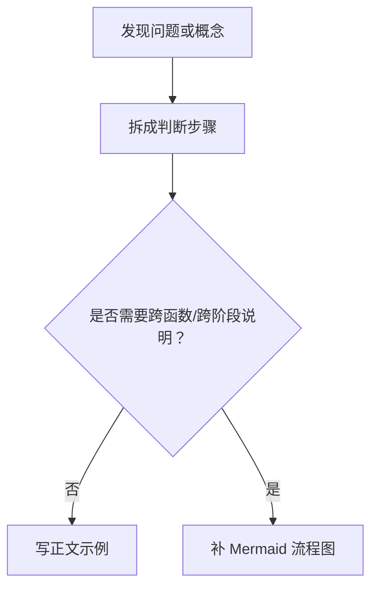

# Blue Espeon Note Style

Use this skill when writing or revising technical notes in this vault and the user wants the output to follow their established note style. If the target file is Markdown in Obsidian, use this skill together with `obsidian-markdown`.

## Core Preferences

- Default new companion notes to the **same directory** as the source note unless the user says otherwise.
- Preserve the existing local naming scheme instead of inventing a new one. For sequenced notes, continue adjacent names such as `2-3a`, `2-3b`.
- When a new note expands an existing section, create an **explicit double link**:
  - In the source note, add a short wikilink near the relevant heading.
  - In the new note, add a top-line backlink such as `关联笔记：[[Source Note#Section]]`.
- For explanatory technical notes, include **Mermaid flowcharts in necessary sections**. Prefer diagrams for decision flow, lifecycle flow, compiler/runtime pipeline, or diagnosis workflow. Do not add decorative diagrams.
- Prefer **concrete, compilable or runnable examples** when explaining language features, compiler behavior, tools, or APIs.
- When discussing implementation details, internals, standards, or current behavior, include **reference links** and note the relevant version/date when it matters.
- Keep prose **concise, direct, and structured**, but detailed enough to support follow-up analysis.

## Library Tutorial Rules

Use these rules when the note teaches a library, package, framework, CLI, or API through examples.

- Every code block must be a **complete minimal unit** that can be compiled or run on its own. For Go, each example should be a full `package main` program unless the user explicitly wants a library snippet instead.
- For Go library notes, add **succinct code comments on every library-related line or block** inside the Go code block. Comment the import, constructor/setup calls, key helper functions, and important method calls that belong to the library. Do **not** waste comments on obvious Go syntax that is unrelated to the library.
- Do not merge "prepare workspace" and "compile" into one command block when the reader must paste a file in between. The default order is:
  1. create directory and `cd`
  2. instruct the reader to save the example as `main.go` (or the exact required filename)
  3. initialize dependencies and compile
  4. show compile result
  5. show run command
  6. show run result
- If local verification is possible, paste the **actual build output** and **actual run output** into the note. If a successful build normally produces no output, show proof of success in a compact way, for example by listing the generated binary.
- If version resolution matters, record the checked date and the resolved version in the note body.
- Keep examples operational for copy-paste use. Avoid hidden prerequisites between adjacent command blocks.

## Writing Workflow

1. Identify the anchor note and its directory.
2. Decide whether the task is:
   - an inline expansion inside the existing note, or
   - a new companion note that should live beside it.
3. If creating a companion note:
   - place it in the same directory;
   - continue the local naming pattern;
   - add the backlink line at the top;
   - add a forward wikilink in the source note at the relevant section.
4. Structure the content so that the reader can scan it top-down:
   - definition or scope;
   - mechanism or workflow;
   - examples;
   - caveats or boundaries;
   - references when needed.
5. Add Mermaid diagrams to sections where process understanding matters.
6. Minimize churn in existing notes. Only edit the source note where the new cross-link is relevant.

For library tutorial notes, refine step 4 into this concrete section pattern:

1. short purpose/when to use
2. one full example program
   - for Go examples, annotate the library-specific parts with concise comments
3. workspace creation commands
4. explicit "paste into `main.go`" instruction
5. compile commands
6. compile result
7. run commands
8. run result
9. brief caveats or selection guidance

## Diagram Rules

- Add at least one Mermaid diagram when the note explains:
  - a decision process;
  - a multi-stage implementation pipeline;
  - a diagnostic workflow;
  - a lifecycle or state transition.
- Prefer `flowchart TD` or `flowchart LR`.
- Keep node text short and analytic. The diagram should help later reasoning, not just restate prose.
- For medium notes, 1 to 3 diagrams is the default sweet spot.

Example:

````markdown

````

## Cross-Link Pattern

Use this pattern when making a companion note:

````markdown
关联笔记：[[原笔记名#相关章节]]

# 新笔记标题
````

In the source note, use a short local sentence near the heading, for example:

```markdown
更详细的说明见：[[新笔记名]]
```

## Reference Rules

- Prefer official or primary sources when the note describes implementation details.
- Use Markdown links for external references.
- If the topic is version-sensitive, state the checked date and version in the note body.
- Do not pad the note with low-signal links; include only the references that support the explanation.

## Editing Discipline

- Preserve the tone and section style of nearby notes.
- Do not rename existing notes unless the user explicitly asks.
- Do not add frontmatter unless the surrounding note set already uses it or the user asks for it.
- When updating an existing note, avoid large rewrites if a targeted insert is enough.

## Default Output Shape

For a new technical companion note, this is the preferred baseline:

1. Backlink line
2. H1 title
3. Short scope/definition section
4. Mechanism section with one Mermaid diagram if needed
5. Concrete examples
6. Caveats or interpretation notes
7. Reference links when the topic depends on external authority

For a library usage note, prefer this stricter baseline instead:

1. H1 title
2. short scope and 2 to 4 key takeaways
3. note that each code block is independently compilable/runnable
4. repeated per-example structure:
   - full example program
   - concise comments on the library-specific lines inside the Go code
   - workspace creation commands
   - instruction to save as `main.go`
   - compile commands
   - compile result
   - run commands
   - run result
5. selection guidance or caveats
